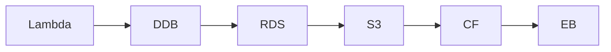

# InfraTales | AWS CDK Multi-Region Fintech Migration: Phased Cutover with Zero Transaction Loss

**CDK TypeScript reference architecture — platform pillar | staff-level level**

> Your fintech system lives in us-east-1, GDPR is breathing down your neck, and eu-central-1 must be live before the audit deadline — with zero tolerance for transaction loss or downtime during cutover. The classic trap: you either big-bang migrate and pray, or you hand-roll a fragile blue-green setup that nobody on your team understands at 2am. This CDK stack codifies the entire phased migration — DynamoDB Global Tables, weighted Lambda routing, S3 CRR, Step Functions approval gates — so the cutover is an orchestrated procedure, not a heroic act.

[](LICENSE)
[](CONTRIBUTING.md)
[](https://aws.amazon.com/)
[](https://aws.amazon.com/cdk/)
[](https://infratales.com/p/3ee9a4d1-3daa-4646-a3bf-e2ceaf3b0175/)
[](https://infratales.com)


## 📋 Table of Contents

- [Overview](#-overview)
- [Architecture](#-architecture)
- [Key Design Decisions](#-key-design-decisions)
- [Getting Started](#-getting-started)
- [Deployment](#-deployment)
- [Docs](#-docs)
- [Full Guide](#-full-guide-on-infratales)
- [License](#-license)

---

## 🎯 Overview

The stack provisions DynamoDB Global Tables across us-east-1 and eu-central-1 in active-active mode, with Lambda functions in both regions behind Route53 weighted routing records that gradually shift traffic percentages during each migration phase [from-code]. S3 buckets in both regions use cross-region replication rules scoped to specific prefixes and capped at objects under 1GB, preventing runaway replication costs on large blobs [from-code]. CloudFront sits in front with origin failover groups — static assets are cached normally while transaction API paths carry Cache-Control bypass headers — and EventBridge handles cross-region event fan-out with deduplication keys and exponential backoff on the target invocation [from-code]. A Step Functions state machine orchestrates the phase progression with manual approval gates modeled as task tokens, so no critical cutover step fires without a human sign-off recorded in SSM Parameter Store [from-code]. The combination of Route53 TTL bleed-through, Global Tables eventual consistency windows, and EventBridge deduplication IDs creates a narrow but real consistency gap in the 72 hours immediately post-cutover — the architecture is individually defensible service by service, but the interaction between these three systems is where compliance-visible data loss actually occurs [inferred].

**Pillar:** PLATFORM — part of the [InfraTales AWS Reference Architecture series](https://infratales.com).
**Target audience:** staff-level cloud and DevOps engineers building production AWS infrastructure.

---

## 🏗️ Architecture



> 📐 See [`diagrams/`](diagrams/) for full architecture, sequence, and data flow diagrams.

> Architecture diagrams in [`diagrams/`](diagrams/) show the full service topology (architecture, sequence, and data flow).
> The [`docs/architecture.md`](docs/architecture.md) file covers component responsibilities and data flow.

---

## 🔑 Key Design Decisions

- DynamoDB Global Tables eventual consistency means a Lambda in eu-central-1 can read a stale transaction record written milliseconds ago in us-east-1 — acceptable for read-heavy dashboards, catastrophic for idempotency checks on payment debit operations [inferred]
- Route53 weighted routing shifts traffic at the DNS TTL boundary, not instantaneously — a 60s TTL means up to 60s of mixed-region traffic during any weight change, which complicates distributed tracing correlation [from-code]
- S3 CRR with a 1GB object size filter requires a Lambda-backed replication rule or S3 Batch Replication for objects that arrived before replication was enabled — the stack provisions forward-only replication, so historical data backfill is a separate runbook step [inferred]
- CloudFront origin failover triggers only on 5xx or connection timeout from the primary origin — a silent data consistency failure (200 with stale data) will not trigger failover, making the health check Lambda critical but easy to misconfigure [inferred]
- Step Functions task token approval gates have a 1-year max timeout — any approval workflow relying on email-based SNS approval that gets lost in spam will stall the state machine silently until someone checks the console [editorial]

> For the full reasoning behind each decision — cost models, alternatives considered, and what breaks at scale — see the **[Full Guide on InfraTales](https://infratales.com/p/3ee9a4d1-3daa-4646-a3bf-e2ceaf3b0175/)**.

---

## 🚀 Getting Started

### Prerequisites

```bash
node >= 18
npm >= 9
aws-cdk >= 2.x
AWS CLI configured with appropriate permissions
```

### Install

```bash
git clone https://github.com/InfraTales/<repo-name>.git
cd <repo-name>
npm install
```

### Bootstrap (first time per account/region)

```bash
cdk bootstrap aws://YOUR_ACCOUNT_ID/YOUR_REGION
```

---

## 📦 Deployment

```bash
# Review what will be created
cdk diff --context env=dev

# Deploy to dev
cdk deploy --context env=dev

# Deploy to production (requires broadening approval)
cdk deploy --context env=prod --require-approval broadening
```

> ⚠️ Always run `cdk diff` before deploying to production. Review all IAM and security group changes.

---

## 📂 Docs

| Document | Description |
|---|---|
| [Architecture](docs/architecture.md) | System design, component responsibilities, data flow |
| [Runbook](docs/runbook.md) | Operational runbook for on-call engineers |
| [Cost Model](docs/cost.md) | Cost breakdown by component and environment (₹) |
| [Security](docs/security.md) | Security controls, IAM boundaries, compliance notes |
| [Troubleshooting](docs/troubleshooting.md) | Common issues and fixes |

---

## 📖 Full Guide on InfraTales

This repo contains **sanitized reference code**. The full production guide covers:

- Complete CDK TypeScript stack walkthrough with annotated code
- Step-by-step deployment sequence with validation checkpoints
- Edge cases and failure modes — what breaks in production and why
- Cost breakdown by component and environment
- Alternatives considered and the exact reasons they were ruled out
- Post-deploy validation checklist

**→ [Read the Full Production Guide on InfraTales](https://infratales.com/p/3ee9a4d1-3daa-4646-a3bf-e2ceaf3b0175/)**

---

## 🤝 Contributing

See [CONTRIBUTING.md](CONTRIBUTING.md) for guidelines. Issues and PRs welcome.

## 🔒 Security

See [SECURITY.md](SECURITY.md) for our security policy and how to report vulnerabilities responsibly.

## 📄 License

See [LICENSE](LICENSE) for terms. Source code is provided for reference and learning.

---

<p align="center">
  Built by <a href="https://www.rahulladumor.com">Rahul Ladumor</a> | <a href="https://infratales.com">InfraTales</a> — Production AWS Architecture for Engineers Who Build Real Systems
</p>
